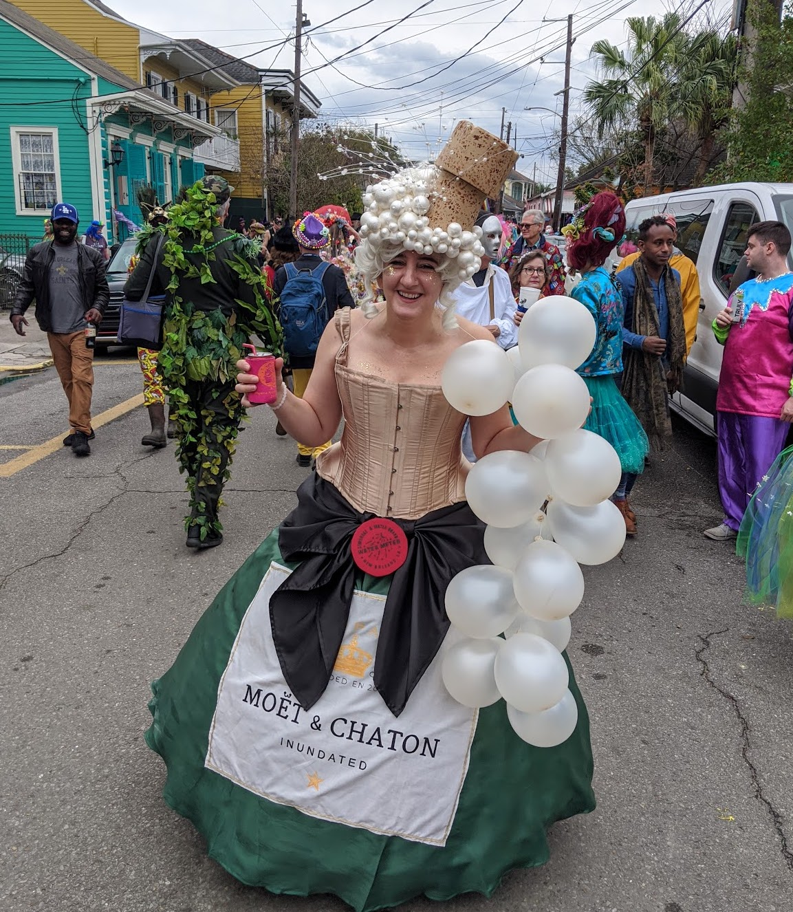
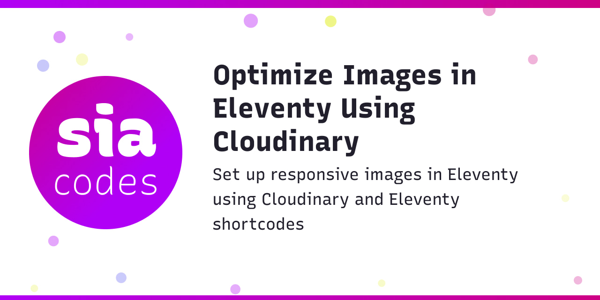

<!-- .slide: data-background="./images/akshar-dave-1GRvY9WUu08-unsplash.jpg" -->
<h1 class="title" style="text-align:left;">Social share images <span class="translucent">using Cloudinary</span></h1>
<h2 class="subtitle" style="color:#333;text-align:left;">Sia Karamalegos</h2>

---

## hi, i'm sia

[sia.codes](https://sia.codes/)



---

TODO: Change!
## [sia.codes/posts/webmentions-eleventy-talk/](https://sia.codes/posts/webmentions-eleventy-talk/)

---

## Show + Tell

Social share images are cool 😎


---

<svg id="cld-main-logo" style="height: 90px; width: 480px; margin-bottom: -10px;" xmlns="http://www.w3.org/2000/svg" viewBox="0 0 500 96.77"><title>Cloudinary Logo</title><defs><style>.cls-1{fill:#3448c5;}</style></defs><g id="Layer_2" data-name="Layer 2"><g id="Layer_1-2" data-name="Layer 1"><path class="cls-1" d="M160.53,30.41a17.14,17.14,0,0,1,13.56,6.7.69.69,0,0,0,1,.11l5.71-4.55a.71.71,0,0,0,.11-1,26,26,0,0,0-20.61-10.13c-14.91,0-27,12.85-27,28.65s12.13,28.65,27,28.65A25.85,25.85,0,0,0,180.9,68.72a.69.69,0,0,0-.12-1l-5.7-4.5a.71.71,0,0,0-1,.11A17.26,17.26,0,0,1,160.53,70c-10.19,0-18.16-8.7-18.16-19.79S150.34,30.41,160.53,30.41Z"></path><path class="cls-1" d="M188.27,19.91h7.16a.71.71,0,0,1,.71.71V77.4a.7.7,0,0,1-.7.7h-7.16a.71.71,0,0,1-.71-.71V20.62A.7.7,0,0,1,188.27,19.91Z"></path><path class="cls-1" d="M220.54,39.55c-9.49,0-19.09,6.72-19.09,19.57,0,11.29,8.21,19.81,19.09,19.81s19.17-8.52,19.17-19.81S231.47,39.55,220.54,39.55Zm10.53,19.57c0,6.52-4.53,11.44-10.53,11.44S210.1,65.64,210.1,59.12s4.49-11.2,10.44-11.2S231.07,52.73,231.07,59.12Z"></path><path class="cls-1" d="M278.3,40.37h-7.16a.7.7,0,0,0-.71.7v19c0,7.42-5.12,10.05-9.51,10.05-3.88,0-7.79-2.93-7.79-9.48V41.07a.7.7,0,0,0-.71-.7h-7.16a.7.7,0,0,0-.7.7v20.5c0,11.25,5.09,17.44,14.34,17.44,3.36,0,8.8-1.93,10.84-6.19l.69.14V77.4a.71.71,0,0,0,.71.71h7.16a.71.71,0,0,0,.71-.71V41.07A.7.7,0,0,0,278.3,40.37Z"></path><path class="cls-1" d="M322.27,19.91H315.1a.7.7,0,0,0-.7.71V46l-.44-.7c-2.18-3.51-6.87-5.78-11.95-5.78-8.76,0-17.62,6.75-17.62,19.65,0,11.25,7.61,19.73,17.69,19.73,3.84,0,9.25-1.54,11.88-5.86l.44-.72V77.4a.7.7,0,0,0,.7.71h7.17a.7.7,0,0,0,.7-.71V20.62A.7.7,0,0,0,322.27,19.91Zm-8,39.21a11,11,0,0,1-10.75,11.36c-5.86,0-10.45-5-10.45-11.36s4.59-11.2,10.45-11.2A11,11,0,0,1,314.24,59.12Z"></path><path class="cls-1" d="M333,40.37h7.16a.7.7,0,0,1,.7.7V77.4a.7.7,0,0,1-.7.7H333a.71.71,0,0,1-.71-.71V41.07A.71.71,0,0,1,333,40.37Z"></path><path class="cls-1" d="M336.61,21.06a5.57,5.57,0,0,0-5.69,5.57,5.64,5.64,0,0,0,5.69,5.58,5.54,5.54,0,0,0,5.61-5.58A5.48,5.48,0,0,0,336.61,21.06Z"></path><path class="cls-1" d="M370.35,39.55c-3.14,0-8.72,1.69-10.85,6.19l-.69-.14V41.07a.7.7,0,0,0-.71-.7h-7.16a.7.7,0,0,0-.7.7V77.4a.7.7,0,0,0,.7.71h7.16a.71.71,0,0,0,.71-.71v-19c0-7.36,5.12-10,9.51-10,3.88,0,7.79,2.91,7.79,9.4V77.4a.71.71,0,0,0,.71.71H384a.71.71,0,0,0,.71-.71V56.91C384.69,45.72,379.59,39.55,370.35,39.55Z"></path><path class="cls-1" d="M427.48,40.37h-7.16a.7.7,0,0,0-.71.7v5l-.43-.7c-2.19-3.51-6.88-5.78-12-5.78-8.75,0-17.62,6.75-17.62,19.65,0,11.25,7.61,19.73,17.7,19.73,3.83,0,9.24-1.54,11.88-5.86l.43-.72V77.4a.71.71,0,0,0,.71.71h7.16a.7.7,0,0,0,.7-.71V41.07A.7.7,0,0,0,427.48,40.37Zm-8,18.75A11,11,0,0,1,408.7,70.48c-5.86,0-10.44-5-10.44-11.36s4.58-11.2,10.44-11.2A11,11,0,0,1,419.46,59.12Z"></path><path class="cls-1" d="M460.15,40.5a13.66,13.66,0,0,0-5.14-1c-4.76,0-8.22,2.85-10,8.25l-.64-.09V41.07a.7.7,0,0,0-.71-.7h-7.16a.7.7,0,0,0-.71.7V77.4a.71.71,0,0,0,.71.71h7.24a.7.7,0,0,0,.7-.71V65c0-14.8,5.91-17,9.44-17a11,11,0,0,1,4.33.9.72.72,0,0,0,.61,0,.7.7,0,0,0,.36-.48l1.42-7.11A.71.71,0,0,0,460.15,40.5Z"></path><path class="cls-1" d="M499.88,40.68a.69.69,0,0,0-.59-.31h-7.71a.72.72,0,0,0-.66.45L481.59,65l-9.42-24.18a.72.72,0,0,0-.66-.45h-7.86a.69.69,0,0,0-.58.31.7.7,0,0,0-.07.66l14,34.38-7.73,20.09a.71.71,0,0,0,.66,1h7.5a.69.69,0,0,0,.65-.45l21.86-55A.69.69,0,0,0,499.88,40.68Z"></path><path class="cls-1" d="M97.91,28.11A40.38,40.38,0,0,0,59.73,0,39.62,39.62,0,0,0,24.6,20.87a29.88,29.88,0,0,0-7.21,56.56l.75.34h.05v-8.5a22.29,22.29,0,0,1,9.29-41.16l2.1-.22L30.5,26A32.15,32.15,0,0,1,59.73,7.57a32.7,32.7,0,0,1,31.55,25L92,35.43l3,0a18.53,18.53,0,0,1,18.15,18.46c0,7.05-4.07,12.82-11,15.74v8.06l.5-.16c11.14-3.65,18.06-12.71,18.06-23.64A26.19,26.19,0,0,0,97.91,28.11Z"></path><path class="cls-1" d="M45.07,76.79l1.66,1.66a.33.33,0,0,1-.23.56H33.4a6,6,0,0,1-6-6V47.57a.33.33,0,0,0-.33-.33H24.27a.33.33,0,0,1-.24-.56L35.15,35.56a.33.33,0,0,1,.47,0L46.73,46.68a.33.33,0,0,1-.23.56H43.66a.34.34,0,0,0-.34.33v25A6,6,0,0,0,45.07,76.79Z"></path><path class="cls-1" d="M69.64,76.79l1.67,1.66a.33.33,0,0,1-.24.56H58a6,6,0,0,1-6-6V54a.34.34,0,0,0-.33-.34H48.84a.33.33,0,0,1-.23-.56L59.72,42a.33.33,0,0,1,.47,0L71.31,53.08a.33.33,0,0,1-.24.56H68.23a.34.34,0,0,0-.33.34V72.57A6,6,0,0,0,69.64,76.79Z"></path><path class="cls-1" d="M94.22,76.79l1.66,1.66a.33.33,0,0,1-.23.56H82.54a6,6,0,0,1-6-6V60.38a.33.33,0,0,0-.33-.33H73.41a.33.33,0,0,1-.23-.57L84.3,48.37a.32.32,0,0,1,.46,0L95.88,59.48a.33.33,0,0,1-.23.57H92.8a.33.33,0,0,0-.33.33V72.57A6,6,0,0,0,94.22,76.79Z"></path></g></g></svg>

- An image and video CDN and API platform.
- Makes responsive images easier. See [Optimize Images in Eleventy Using Cloudinary](https://sia.codes/posts/eleventy-and-cloudinary-images/).

---

## Pricing


<small>[cloudinary.com/pricing](https://cloudinary.com/pricing)</small>

---

## Free Tier Hack

- Write an article about Cloudinary
- Add your personal share link
- Get up to 60 additional credits
- (Or use a Discord thread to share your codes amongst each other - I'm already maxed out!)

---

## Prior Art

I built my share images using **Jason Lengstorf's** article [Automatically Generate Social Images for Blog Posts](https://www.learnwithjason.dev/blog/auto-generate-social-image/) and modifying it to use Eleventy Shortcodes.

---



---


## Elements

- Title
- Subtitle
- Underlying graphic
- *(+ whatever else you want)*

---


## How it works

- **Underlying graphic** - the base image
- **Title** - text overlay positioned uppish
- **Subtitle** - text overlay positioned downish
- Also note it uses a custom font

---

## The URL that delivers this image

<p style="word-wrap: break-word;font-size: 1.6rem">https://res.cloudinary.com/siacodes/image/upload/w_1280,h_640,q_auto:best,c_fill,f_jpg/w_705,c_fit,co_rgb:221f2c,g_south_west,x_455,y_306,l_text:RecursiveSansExtraBold.woff2_60:Optimize%20Images%20in%20Eleventy%20Using%20Cloudinary/w_705,c_fit,co_rgb:221f2c,g_north_west,x_455,y_356,l_text:RecursiveSansRegular.woff2_36_line_spacing_10:Set%20up%20responsive%20images%20in%20Eleventy%20using%20Cloudinary%20and%20Eleventy%20shortcodes/v1607719366/sia.codes/twitter_tmpl.jpg</p>

---

## Underlying graphic <!-- .element: style="text-align: left;" -->

Sorry, you're on your own. Start drawing on paper or something. Or copy someone else's design and modify it to make it your own. <!-- .element: style="text-align: left;" -->

The dimensions that worked for me were 1280 x 640.<!-- .element: style="text-align: left;" -->

---

## Text Overlays: What we need

- The actual text content
- Which font to use
- How to size the text
- How to position the text... side quest...

---

## Positioning with Gravity

[Interactive demo](https://cloudinary-training.github.io/cld-advanced-concepts/overlay-underlay/positioning-app/docs/index.html)

<small>Docs: [Positioning layers with gravity](https://cloudinary.com/documentation/layers#positioning_layers_with_gravity)</small>

---

## Positioning with Gravity: Preventing overlapping text

- **Title**: Use `south_west` with a y-offset from the bottom
- **Subitle**: Use `north_west` with a y-offset from the top

---

## Building the image: Base image

```javascript
const width = "1280"
const height = "640"
const imageConfig = [
  `w_${width}`,
  `h_${height}`,
  "q_auto:best", // quality: better than the default
  "c_fill", // crop: fill without distortion, may be cropped
  "f_jpg", // format: JPG
].join(",")

// imageConfig:
// "w_1280,h_640,q_auto:best,c_fill,f_jpg"
```

---

## Building the image: Title layer

```javascript
const titleConfig = [
  `w_${TEXT_AREA_WIDTH}`,
  'c_fit', // crop: Resizes to fit, maintaining aspect ratio
  `co_rgb:${TEXT_COLOR}`,
  'g_south_west',
  `x_${TEXT_LEFT_OFFSET}`,
  `y_${TITLE_BOTTOM_OFFSET}`,
  `l_text:${TITLE_FONT}_${TITLE_FONT_SIZE}:${cloudinarySafeText(title)}`,
].join(",")

// titleConfig:
// "w_705,c_fit,co_rgb:221f2c,g_south_west,x_455,y_306,l_text:
//  RecursiveSansExtraBold.woff2_60:Optimize%20Images%20in%20
//  Eleventy%20Using%20Cloudinary"
```

<small>Note: If the font is not in the root of your Cloudinary media library, prepend it with `foldername:`, replacing "foldername" with the folder name.</small>

---

## Cloudinary safe text

```js
function cloudinarySafeText(text) {
  return encodeURIComponent(text)
    .replace(/(%2C)/g, '%252C')
    .replace(/(%2F)/g, '%252F')
}
```

<small>[How to add a special characters in text overlays?](https://support.cloudinary.com/hc/en-us/articles/202521512-How-to-add-a-slash-character-or-any-other-special-characters-in-text-overlays-)</small>

---

## Building the image: Subtitle layer

```javascript
const taglineConfig = [
    `w_${TEXT_AREA_WIDTH}`,
    'c_fit',
    `co_rgb:${TEXT_COLOR}`,
    'g_north_west',
    `x_${TEXT_LEFT_OFFSET}`,
    `y_${TAGLINE_TOP_OFFSET}`,
    `l_text:${TAGLINE_FONT}_${TAGLINE_FONT_SIZE}
       _line_spacing_${TAGLINE_LINE_HEIGHT}:
       ${cloudinarySafeText(description)}`,
  ].join(',');

// taglineConfig:
// "w_705,c_fit,co_rgb:221f2c,g_north_west,x_455,y_356,l_text:
//  RecursiveSansRegular.woff2_36_line_spacing_10:Set%20up%20
//  responsive%20images%20in%20Eleventy%20using%20Cloudinary%20
//  and%20Eleventy%20shortcodes"
```

---

## Putting it all together

```js
const BASE_URL = `https://res.cloudinary.com/${CLOUDNAME}/
  image/upload/`;

const shareImage = `${BASE_URL}${imageConfig}/${titleConfig}/
  ${taglineConfig}/${FOLDER}${SHARE_IMAGE_FILE_NAME}`
```

---

## Invoking it with Shortcodes

I wrap all this code in a function `socialImageUrl` that I use as a shortcode:

```html
<!-- In my base layout file -->
<meta property="og:description" content="{{ renderDescription }}" />
<meta property="og:url" content="https://sia.codes/" />
<meta property="og:title" content="{{ renderTitle }}" />
<meta property="og:image" content="">
<meta property="og:image:type" content="image/png">
<meta property="og:image:width" content="1280">
<meta property="og:image:height" content="640">
```

<small>See the full implementation in my [shortcodes file](https://github.com/siakaramalegos/sia.codes-eleventy/blob/main/src/_11ty/shortcodes.js) and my [base layout file](https://github.com/siakaramalegos/sia.codes-eleventy/blob/main/src/_includes/layouts/base.njk#L28-L34).</small>

---

<!-- .slide: data-background="./images/akshar-dave-1GRvY9WUu08-unsplash.jpg" -->
<h1 class="title" style="text-align:left;">Thanks!</h1>

<p style="color:#333;text-align:left;">Slides:<br> <a href="https://sia.codes/posts/webmentions-eleventy-talk/" class="link-secondary">sia.codes/posts/webmentions<br>-eleventy-talk/</a></p>
<p style="color:#333;text-align:left;">Writing, resources, and more:<br> <a href="https://sia.codes/" class="link-secondary">sia.codes</a></p>

---

## Photo credits

- Heart balloons <span>Photo by <a href="https://unsplash.com/@akshar_dave?utm_source=unsplash&amp;utm_medium=referral&amp;utm_content=creditCopyText">Akshar Dave</a> on <a href="https://unsplash.com/?utm_source=unsplash&amp;utm_medium=referral&amp;utm_content=creditCopyText">Unsplash</a></span>
